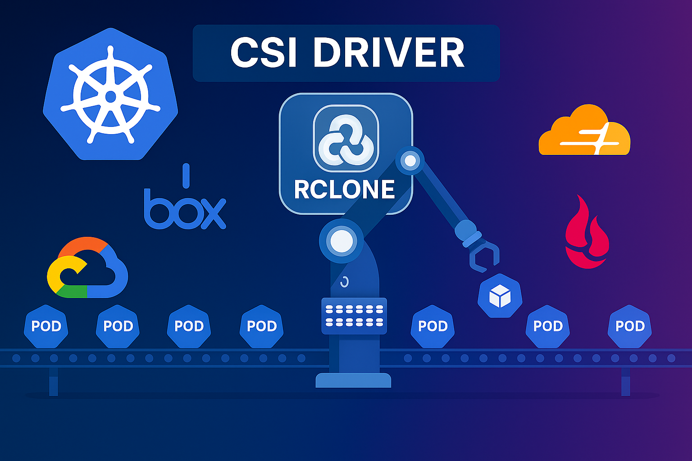
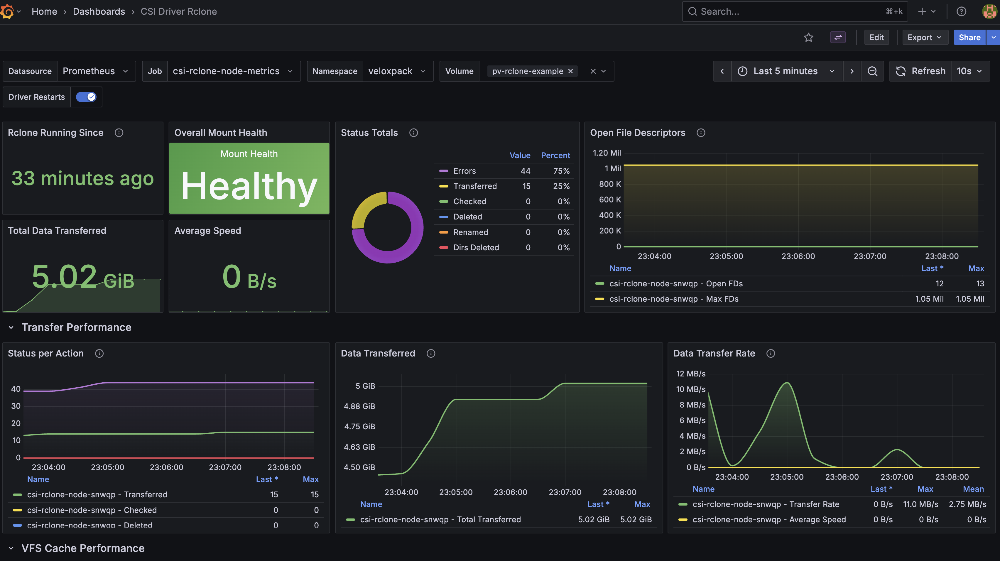

<h1 align="center">
  <a href="https://www.veloxpack.io/docs/csi-driver-rclone">
    
  </a>
  <br>
  <a href="https://www.veloxpack.io/docs/csi-driver-rclone">
    Rclone CSI Driver for Kubernetes
  </a>
</h1>


[](https://github.com/veloxpack/csi-driver-rclone/actions/workflows/trivy.yaml)

**Quick Links:** [Features](#features) | [Requirements](#requirements) | [Installation](#install-driver-on-a-kubernetes-cluster) | [Quick Start](#quick-start-guide) | [Examples](#examples) | [Development](#development) | [Documentation](./docs/)

### Overview

This is a repository for [Rclone](https://rclone.org/) [CSI](https://kubernetes-csi.github.io/docs/) driver, csi plugin name: `rclone.csi.veloxpack.io`. This driver enables Kubernetes pods to mount cloud storage backends as persistent volumes using rclone, supporting 50+ storage providers including S3, Google Cloud Storage, Azure Blob, Dropbox, and many more.

### Container Images & Kubernetes Compatibility:
|driver version  | supported k8s version | status |
|----------------|-----------------------|--------|
|main branch     | 1.20+                 | GA     |
|v0.1.0          | 1.20+                 | GA     |

## Features

- **50+ Storage Providers**: Supports Amazon S3, Google Cloud Storage, Azure Blob, Dropbox, SFTP, and [many more](./deploy/example/README.md)
- **No External Dependencies**: Uses rclone as a Go library directly - no rclone binary installation required
- **No Process Overhead**: Direct library integration means no subprocess spawning or external process management
- **Dynamic Volume Provisioning**: Create persistent volumes via StorageClass
- **Secret-based Configuration**: Secure credential management using Kubernetes secrets
- **Inline Configuration**: Direct configuration in StorageClass parameters
- **Template Variable Support**: Dynamic path substitution using PVC/PV metadata
- **VFS Caching**: High-performance caching with configurable options
- **No Staging Required**: Direct mount without volume staging
- **Flexible Backend Support**: Choose between minimal or full backend support for smaller images

## Requirements

### Production
- Kubernetes 1.20 or later
- CSI node driver registrar
- FUSE support on nodes (for mounting)
- **No rclone installation required** - the driver uses rclone as a Go library directly

### Development/Testing
For local development and testing, we recommend using one of these lightweight Kubernetes distributions:
- **[minikube](https://minikube.sigs.k8s.io/)** - Easy local Kubernetes cluster with good driver support
- **[kind](https://kind.sigs.k8s.io/)** (Kubernetes in Docker) - Lightweight and fast for CI/CD
- **[k3s](https://k3s.io/)** - Minimal Kubernetes distribution, great for edge and IoT

See the [Development](#development) section for using Skaffold with these tools for the fastest development workflow.

## Install driver on a Kubernetes cluster

> **💡 For Development:** Use [Skaffold](#development) for the fastest development workflow with automatic rebuilds and live reload.

#### Option 1: Install via Helm (Recommended for Production)

**Which installation method should I use?**
- **Production deployment?** → Use Helm (this section)
- **Development with live reload?** → Use [Skaffold](#development) (see Development section)
- **Manual control needed?** → Use [kubectl](#option-2-install-via-kubectl-manual)

**Basic Installation:**

```bash
# Install with default configuration
helm install csi-rclone oci://ghcr.io/veloxpack/charts/csi-driver-rclone

# Install in a specific namespace
helm install csi-rclone oci://ghcr.io/veloxpack/charts/csi-driver-rclone \
  --namespace veloxpack --create-namespace
```

**With Monitoring & Observability:**

Choose the monitoring level that fits your needs:

```bash
# Option A: Basic metrics endpoint
# Use this for custom Prometheus configurations or basic monitoring
helm upgrade --install csi-rclone oci://ghcr.io/veloxpack/charts/csi-driver-rclone \
  --namespace veloxpack --create-namespace \
  --set node.metrics.enabled=true

# Option B: Metrics + Kubernetes Service
# Use this if you have Prometheus configured to discover services
helm upgrade --install csi-rclone oci://ghcr.io/veloxpack/charts/csi-driver-rclone \
  --namespace veloxpack --create-namespace \
  --set node.metrics.enabled=true \
  --set node.metrics.service.enabled=true

# Option C: Full monitoring stack (Recommended for production monitoring)
# Includes: metrics + ServiceMonitor (Prometheus Operator) + Grafana Dashboard
# Requires: Prometheus Operator installed (kube-prometheus-stack)
helm upgrade --install csi-rclone oci://ghcr.io/veloxpack/charts/csi-driver-rclone \
  --namespace veloxpack --create-namespace \
  --set node.metrics.enabled=true \
  --set node.metrics.service.enabled=true \
  --set node.metrics.serviceMonitor.enabled=true \
  --set node.metrics.dashboard.enabled=true \
  --set node.metrics.dashboard.namespace=monitoring
```

<details>
<summary>Advanced metrics configuration options</summary>

Customize metrics server settings:

```bash
helm upgrade --install csi-rclone oci://ghcr.io/veloxpack/charts/csi-driver-rclone \
  --namespace veloxpack --create-namespace \
  --set node.metrics.enabled=true \
  --set node.metrics.addr=:5572 \
  --set node.metrics.path=/metrics \
  --set node.metrics.readTimeout=10s \
  --set node.metrics.writeTimeout=10s \
  --set node.metrics.idleTimeout=60s
```

</details>


Verify the installation:

```bash
# Check release status
helm list -n veloxpack

# Verify pods are running
kubectl get pods -n veloxpack -l app.kubernetes.io/name=csi-driver-rclone
```

#### Option 2: Install via kubectl (Manual)

For manual installation using kubectl and kustomize:

```bash
# Deploy the driver
kubectl apply -k deploy/overlays/default
```

This will install:
- CSI Controller (StatefulSet)
- CSI Node Driver (DaemonSet)
- RBAC permissions
- CSIDriver CRD

For detailed manual installation options and overlays, see the [manual installation guide](./docs/install-rclone-csi-driver.md).

### Driver parameters
Please refer to [`rclone.csi.veloxpack.io` driver parameters](./docs/driver-parameters.md)

### Examples
 - [Basic usage](./deploy/example/README.md)
 - [S3 Storage](./deploy/example/storageclass-s3.yaml)
 - [Google Cloud Storage](./deploy/example/storageclass-gcs.yaml)
 - [Azure Blob Storage](./deploy/example/storageclass-azure.yaml)
 - [MinIO](./deploy/example/storageclass-minio.yaml)
 - [Dropbox](./deploy/example/secret-dropbox.yaml)
 - [SFTP](./deploy/example/secret-sftp.yaml)

### Troubleshooting
 - [CSI driver troubleshooting guide](./docs/csi-debug.md)

## Development

### Quick Start with Skaffold (Recommended)

[Skaffold](https://skaffold.dev/) provides the fastest development workflow with automatic rebuilds and deployments.

**Install Skaffold:**
```bash
# macOS
brew install skaffold

# Linux
curl -Lo skaffold https://storage.googleapis.com/skaffold/releases/latest/skaffold-linux-amd64 && \
sudo install skaffold /usr/local/bin/

# Windows
choco install skaffold
```

**Start developing:**
```bash
# Basic development (no metrics)
skaffold dev

# Full monitoring stack (Prometheus + Grafana)
skaffold dev -p metrics-full
```

Skaffold will:
- Build the Docker image on code changes
- Deploy to your local cluster (minikube/kind/k3s)
- Stream logs from all components
- Auto-reload on file changes
- Setup port-forwarding for metrics and dashboards

### Available Skaffold Profiles

| Profile | Description | Port Forwards | Use Case |
|---------|-------------|---------------|----------|
| `default` | Basic CSI driver | None | Development without metrics |
| `metrics` | Metrics endpoint only | None | Testing metrics collection |
| `metrics-service` | Metrics + Service | :5572 | Service-based scraping |
| `metrics-prometheus` | Full Prometheus integration | :5572, :9090 | Prometheus development |
| `metrics-dashboard` | Grafana dashboard only | :3000 | Dashboard testing |
| `metrics-full` | Complete monitoring | :5572, :9090, :3000 | Full stack development |

**Examples:**
```bash
# Development with full monitoring (recommended)
skaffold dev -p metrics-full
# Access: http://localhost:5572/metrics (metrics)
#         http://localhost:9090 (Prometheus)
#         http://localhost:3000 (Grafana - admin/prom-operator)

# Just metrics endpoint
skaffold dev -p metrics

# Prometheus integration only
skaffold dev -p metrics-prometheus
```

### Metrics Dashboard

The driver includes a comprehensive Grafana dashboard for monitoring and observability:

<p align="center">
  
</p>

**Dashboard Features:**
- **Overview & Rclone Statistics**: Real-time health, uptime, file operations summary
- **Transfer Performance**: Data transfer rates, cumulative transfers, operation timelines
- **VFS Cache Performance**: File handles, disk cache usage, metadata cache, upload queues
- **Mount Health & Details**: Detailed mount information with health status
- **System Resources**: CPU, memory, and Go runtime metrics

Access the dashboard at `http://localhost:3000` when using Skaffold profiles with monitoring enabled.

### Prerequisites for Metrics Profiles

For `metrics-prometheus` and `metrics-full` profiles, install Prometheus Operator:

```bash
helm repo add prometheus-community https://prometheus-community.github.io/helm-charts
helm repo update
helm install kube-prometheus-stack prometheus-community/kube-prometheus-stack \
  --namespace monitoring --create-namespace
```

### Testing & Code Quality

```bash
# Run tests
go test ./pkg/rclone/...

# Run linter
./bin/golangci-lint run --config .golangci.yml ./...
```

### Local Binary Development

For testing the driver binary directly without Kubernetes:

```bash
# Build the binary
make build

# Run driver locally
./bin/rcloneplugin --endpoint unix:///tmp/csi.sock --nodeid CSINode -v=5
```

### Alternative: Manual Development

For detailed manual setup and testing procedures, see the [development guide](./docs/csi-dev.md).

## Quick Start Guide

Once you've [installed the driver](#install-driver-on-a-kubernetes-cluster), follow these steps to start using cloud storage in your pods:

### 1. Configure Storage Backend

Create a secret with your storage backend configuration:

```yaml
apiVersion: v1
kind: Secret
metadata:
  name: rclone-secret
  namespace: default
type: Opaque
stringData:
  remote: "s3"
  remotePath: "my-bucket"
  configData: |
    [s3]
    type = s3
    provider = AWS
    access_key_id = YOUR_ACCESS_KEY_ID
    secret_access_key = YOUR_SECRET_ACCESS_KEY
    region = us-east-1
```

### 2. Create StorageClass

```yaml
apiVersion: storage.k8s.io/v1
kind: StorageClass
metadata:
  name: rclone-csi
provisioner: rclone.csi.veloxpack.io
parameters:
  remote: "s3"
  remotePath: "my-bucket"
csi.storage.k8s.io/node-publish-secret-name: "rclone-secret"
csi.storage.k8s.io/node-publish-secret-namespace: "default"
reclaimPolicy: Delete
volumeBindingMode: Immediate
allowVolumeExpansion: true
```

### 3. Create PVC and Pod

```yaml
apiVersion: v1
kind: PersistentVolumeClaim
metadata:
  name: pvc-rclone
spec:
  accessModes:
    - ReadWriteMany
  resources:
    requests:
      storage: 10Gi
  storageClassName: rclone-csi
---
apiVersion: v1
kind: Pod
metadata:
  name: nginx-rclone
spec:
  containers:
  - name: nginx
    image: nginx
    volumeMounts:
    - name: data
      mountPath: /data
  volumes:
  - name: data
    persistentVolumeClaim:
      claimName: pvc-rclone
```

## Configuration Methods

### Method 1: Kubernetes Secrets (Recommended)
Store sensitive credentials in Kubernetes secrets and reference them in StorageClass.

### Method 2: Inline Configuration
Include configuration directly in StorageClass parameters.

### Method 3: PersistentVolume Configuration
Configure directly in PersistentVolume volumeAttributes.

**Priority**: volumeAttributes > StorageClass parameters > Secrets

## Dynamic Path Substitution

The driver supports template variables in the `remotePath` parameter:

| Variable | Description | Example |
|----------|-------------|---------|
| `${pvc.metadata.name}` | PVC name | `my-pvc-12345` |
| `${pvc.metadata.namespace}` | PVC namespace | `default` |
| `${pv.metadata.name}` | PV name | `pv-rclone-abc123` |

**Example:**
```yaml
parameters:
  remote: "s3"
  remotePath: "my-bucket/${pvc.metadata.namespace}/${pvc.metadata.name}"
```

### VFS Cache Options
```yaml
apiVersion: v1
kind: PersistentVolume
metadata:
  name: pv-rclone-performance
spec:
  mountOptions:
    - vfs-cache-mode=writes
    - vfs-cache-max-size=10G
    - dir-cache-time=30s
  csi:
    driver: rclone.csi.veloxpack.io
    volumeHandle: performance-volume
    volumeAttributes:
      remote: "s3"
      remotePath: "my-bucket"
      configData: |
        [s3]
        type = s3
        provider = AWS
        access_key_id = YOUR_ACCESS_KEY_ID
        secret_access_key = YOUR_SECRET_ACCESS_KEY
```

## Troubleshooting

### Check Driver Status
```bash
# Check controller pods
kubectl get pods -n veloxpack -l app=csi-rclone-controller

# Check node pods
kubectl get pods -n veloxpack -l app=csi-rclone-node

# Check logs
kubectl logs -n veloxpack -l app=csi-rclone-controller
kubectl logs -n veloxpack -l app=csi-rclone-node
```

### Verify Driver Functionality
```bash
# Check if the driver is working correctly
kubectl exec -n veloxpack -l app=csi-rclone-node -- /rcloneplugin --help

# Check driver version information (shows when driver starts)
kubectl logs -n veloxpack -l app=csi-rclone-node --tail=10 | grep "DRIVER INFORMATION" -A 10
```

### Common Issues
1. **Authentication failures**: Verify credentials in secrets or configData
2. **Network connectivity**: Ensure nodes can reach the storage backend
3. **Permission errors**: Check that credentials have proper access rights
4. **Configuration format**: Ensure configData is valid INI format
5. **Resource constraints**: Verify sufficient memory and disk space

For detailed troubleshooting, see the [debug guide](./docs/csi-debug.md).

## Building from Source

```bash
# Clone repository
git clone https://github.com/veloxpack/csi-driver-rclone.git
cd csi-driver-rclone

# Build binary
make build

# Build Docker image
make container

# Push to registry
make push
```

### Docker Build Options

The driver supports two backend configurations for different use cases:

#### Full Backend Support (Default)
Includes all 50+ rclone backends for maximum compatibility:

```bash
# Build with all backends (default)
docker build -t csi-rclone:latest .

# Or explicitly specify
docker build --build-arg RCLONE_BACKEND_MODE=all -t csi-rclone:latest .
```

#### Minimal Backend Support
Includes only the most common backends for smaller image size:

```bash
# Build with minimal backends
docker build --build-arg RCLONE_BACKEND_MODE=minimal -t csi-rclone:minimal .
```

**Minimal backends include:**
- Amazon S3 and S3-compatible storage
- Google Cloud Storage
- Azure Blob Storage
- Dropbox
- Google Drive
- OneDrive
- Box
- Backblaze B2
- SFTP
- WebDAV
- FTP
- Local filesystem

**Benefits of minimal build:**
- Smaller Docker image size
- Faster container startup
- Reduced attack surface
- Lower memory footprint

Choose the build that fits your needs - full support for maximum compatibility or minimal for production efficiency.

## Architecture

This driver is based on the [csi-driver-nfs](https://github.com/kubernetes-csi/csi-driver-nfs) reference implementation, following CSI specification best practices. It also draws inspiration from the original [csi-rclone](https://github.com/wunderio/csi-rclone) implementation by WunderIO.

**Components:**
- **Identity Server**: Plugin metadata and health checks
- **Controller Server**: Volume lifecycle management (create/delete)
- **Node Server**: Volume mounting/unmounting on nodes

**Key Design Decisions:**
1. **No Staging**: Rclone volumes don't require staging
2. **Direct Rclone Integration**: Uses rclone's Go library directly
3. **Remote Creation**: Creates temporary remotes for each mount
4. **VFS Caching**: Leverages rclone's VFS for improved performance
5. **Template Variable Support**: Dynamic path substitution using PVC/PV metadata

## Security Considerations

1. **Use Secrets**: Store sensitive credentials in Kubernetes secrets
2. **RBAC**: Ensure proper RBAC permissions are configured
3. **Network Policies**: Consider using network policies to restrict access
4. **Image Security**: Use trusted container images
5. **Credential Rotation**: Regularly rotate storage backend credentials

### Log Levels
Set log level for debugging:
```yaml
args:
  - "--v=5"  # Verbose logging
  - "--logtostderr=true"
```

## License

This project is licensed under the MIT License. See the [LICENSE](LICENSE) file for details.

## Contributing

Contributions welcome! Please ensure:
- All code passes `golangci-lint` checks
- Follow existing code patterns
- Add tests for new functionality
- Update documentation

## Acknowledgments

This project builds upon the excellent work of several open source communities:

- **[WunderIO/csi-rclone](https://github.com/wunderio/csi-rclone)** - The original rclone CSI driver implementation that inspired this project
- **[Kubernetes CSI NFS Driver](https://github.com/kubernetes-csi/csi-driver-nfs)** - Reference implementation and architectural patterns
- **[Rclone](https://rclone.org/)** - The powerful cloud storage sync tool that makes this driver possible
- **[Kubernetes CSI Community](https://github.com/kubernetes-csi)** - For the Container Storage Interface specification and ecosystem

Special thanks to the maintainers and contributors of these projects for their dedication to open source software.

## Support

- [Rclone Documentation](https://rclone.org/)
- [CSI Specification](https://github.com/container-storage-interface/spec)
- [Issue Tracker](https://github.com/veloxpack/csi-driver-rclone/issues)
- [Discussions](https://github.com/veloxpack/csi-driver-rclone/discussions)
